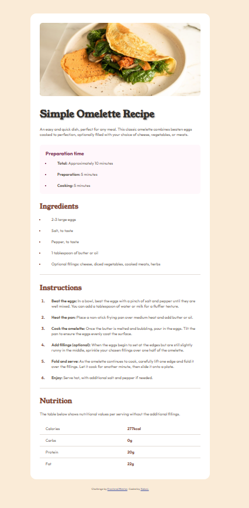

# Frontend Mentor - Recipe page solution

This is a solution to the [Recipe page challenge on Frontend Mentor](https://www.frontendmentor.io/challenges/recipe-page-KiTsR8QQKm). Frontend Mentor challenges help you improve your coding skills by building realistic projects. 

## Table of contents

- [Overview](#overview)
  - [The challenge](#the-challenge)
  - [Screenshot](#screenshot)
  - [Links](#links)
- [My process](#my-process)
  - [Built with](#built-with)
  - [What I learned](#what-i-learned)
  - [Continued development](#continued-development)
  - [Useful resources](#useful-resources)
- [Author](#author)
- [Acknowledgments](#acknowledgments)

### Screenshot

### Links

- Solution: [Frontend Mentor Solution](#)
- Live Site URL: [Live Site](https://xolanixad.github.io/recipe-page-project/)

## My process

### Built with

- Semantic HTML5 markup
- CSS custom properties
- Flexbox
- Mobile-first workflow

### What I learned

I learnt that sometimes redoing a project can be a super power. At first, I successfully completed the project but it was during the time I did not learn about Git and Github yet. I did not include that version of the project in my current repo because I felt like I wanted to start afresh with my newly learnt Git skills. The real super power of redoing the project is that I became quicker, wrote cleaner code and was more accurate than before.

### Continued development

I strive to ensure that I write better code in the first few versions of my commits compared to my past self. I also want to learn about Tailwind as part of my continuous journey of learning and to adopt more best practices in the world of development.

### Useful resources

- [Figma](https://www.figma.com) - This Figma file that I downloaded from Frontend Mentor helped me by giving me the precise styling guides from spacing to coloring. This ensured that I would not waste time doing trial and error styling the project.
- [SuperSimpleDev](https://www.youtube.com/watch?v=hrTQipWp6co&t=1837s) - This is an amazing YouTube tutorial for learning Git that I used.

## Author

- Frontend Mentor - [@XolaniXAD](https://www.frontendmentor.io/profile/XolaniXAD)

## Acknowledgments

I would like to thank one of my peers who is still in the phase of learning HTML and CSS for giving me the itch to improve my project again by redoing it.
